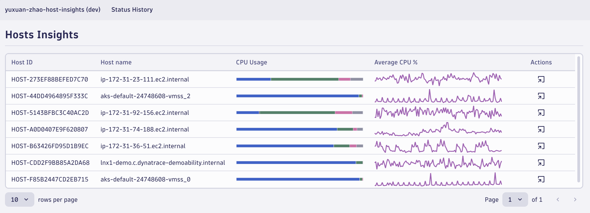

# Explore Dynatrace App Development

This Application was bootstrapped with **Dynatrace App Toolkit**, a command line tool to create, develop and deploy apps in the Dynatrace environment

In this project, I followed the [tutorial](https://developer.dynatrace.com/quickstart/tutorial/create-new-dynatrace-app/) to walk through the process of creating, developing and deploying a Dynatrace app.

The deployed application can be accessed here: [My Host Insights App](https://wml40232.apps.dynatrace.com/ui/apps/my.yuxuan.zhao.host.insights/).

Through this project, I gained first experience with the following features:

- Query metrics using **Dynatrace Query Language (DQL)**.

- Visualize metrics data with **Strato design system** components like Meterbar and Sparkline.

- Extend app functionality by sending **intents**.

- Generate serverless **app function** that serves as backend to access external data.

## Create a Dynatrace App

We use Dynatrace App Toolkit to build an app based on the template. Run the command in the terminal:

```
npx dt-app@latest create --environment-url https://<environment-id>.apps.dynatrace.com
```

Note: Dynatrace provides a **playground environment** with some data for us to discover the features of Dynatrace without needing access to a production environment. To generate a project in this envionment, replace environment-id with `wkf10640`.

## Query metrics using DQL

**Dynatrace Query Language (DQL)** is a tool for retrieving and analyzing metrics data within the Dynatrace environment.

### Grant Access to Data

Before querying metrics data, we need to grant our app with access to metrics and entities. Add permissions "storage:metrics:read" and "storage:entities:read" in the `app.config.json` file.

```json
"scopes": [
   {
      "name": "storage:metrics:read",
      "comment": "Allows to read metrics"
   },
   {
      "name": "storage:entities:read",
      "comment": "Allows to read entities"
   }
]
```

### Write Queries using DQL

Write query that calculates the average CPU usage for all hosts in 1-minute intervals.

```
timeseries cpuAvg = avg(dt.host.cpu.usage), by:{dt.entity.host, host.name}
| fieldsRename hostId = dt.entity.host, hostName = host.name
```

Join a subquery to add fields representing other average metrics for the timeframe. Full query:

```
timeseries cpuAvg = avg(dt.host.cpu.usage), split by: 1m, by:{dt.entity.host, host.name}
| fieldsRename hostId = dt.entity.host, hostName = host.name
| lookup [
  timeseries {
    idle=avg(dt.host.cpu.idle),
    ioWait=avg(dt.host.cpu.iowait),
    user=avg(dt.host.cpu.user),
    system=avg(dt.host.cpu.system),
    steal=avg(dt.host.cpu.steal)
  },
  by:{dt.entity.host}
  | fieldsAdd idle = arrayAvg(idle), ioWait = arrayAvg(ioWait), user = arrayAvg(user), system = arrayAvg(system), steal = arrayAvg(steal)
  | fieldsAdd other = 100 - idle - ioWait - user - system - steal
], sourceField:hostId, lookupField:dt.entity.host, fields:{idle, ioWait, user, system, steal, other}
```

### Ingest Data

During the tutorial, I worked in the Dynatrace Playground sandbox environment, leveraging pre-loaded data. In practice, it's necessary to deploy Dynatrace on the according platform to achieve monitoring of the application. Or, we can ingest metrics records via Dynatrace API, I ingested `cpu.ram` records in the environment for testing.

## Visualize data with Strato design system

The Strato design system offers multiple out-of-the-box components to visualize time-series data. I used this library with React framework to build components in my app:

- Meterbar: To display CPU usage percentages as percentage bars.
- Sparkline: To display CPU usage trends over time.



## Intents

Intent is a message object we define in an app that allows us to exchange user flows from one app to another. There are three elements invovled when sending intents: source app, target app and AppShell.

An intent is sent from a source app to a target app through the AppShell. The AppShell acts as an intermediary, allowing users to select the target app from a list and passing the intent payload as query arguments in the URL.

I learned to use intents to extend the functionnality of querying metrics for individual hosts in my app:

1. First, create additional queries (such as `getHostAvgCpuQuery`) to fetch in the `src/app/queries` that our app will include as the intent payload.

2. Create a **row action** in the table and add the `IntentButton` component with the intent payload. This button allow user to trigger intent payload.

By clicking the button of each row, we can access the **Notebook** App and execute queries on the specific host.

## Generate App functions

**App functions** serve as an app's backend. Every TypeScript file in the project's `/api` directory is automatically deployed as an serverless app function and exposed as an API endpoint. Typically we use app functions to access third-party APIs ove the internet.

I worked on how to generate an app function to fetch data from external API (https://dt-url.net/status-history) and visualize them.

### Genrate the App Function

Run the command in the terminal to create a new app function:

```
npm run generate:function get-status-history
```

### Write the logic

I implemented the logic in the generated file to **fetch** data from the API and also the corresponding unit tests using **Jest**.

### Allow outbound connections

Outbound connections from functions are not allowed by default due to security restrictions. To perform a call to an external host, we need to allow connections to the host (ex. dt-url.net and developer.dynatrace.com) in the `Settings` app of the account.

## Available Commands of Dynatrace App Toolkit

1. Run the app in the development mode:

   `npm run start`

If we edit a component file in `src` and save it, the page will reload when we save changes. We may also see any errors in the console.

2. Build the app for production:

   `npm run build`

3. Deploy the app:

   `npm run deploy`

   Builds the app and deploys it to the specified environment in `app.config.json`.

4. Generate a serverless app function:

   `npm run generate:function`

   Generates a new serverless function for your app in the `api` folder.

## Additional Notes

### Dynatrace Playground

Dynatrace provides a playground environment with pre-loaded data for experimentation. This is useful for learning and testing features without impacting production systems. However, apps developed in the playground cannot be deployed to this environment.

### Troubleshooting Deployment Issues

When I tried deploying the application, I encountered the error:

```
Error: Failed to install the app
HTTP: 403 Forbidden
```

To troubleshoot the potential causes, it's necessary to change the `environmentUrl` to my own environment.

## Conclusion

This sample project was a great opportunity to learn to build metrics monitoring apps in Dynatrace system. I now have a better understanding of:

- Use DQL to query metrics.
- Build visualization of metrics data using Strato Design System and React framework.
- Extend app functionnality wih intents and app functions.

To be continued, the next step should be discovering the ingestion of data to monitor system.
